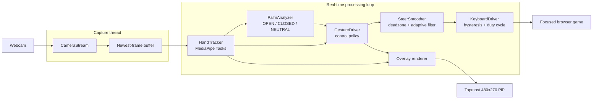

# Gesture Car Control

Real-time, touch-free control for browser driving games using computer vision.

Gesture Car Control converts webcam hand movements into progressive steering,
acceleration, and braking. It combines MediaPipe hand landmarks, custom
geometric gesture classification, frame-rate-independent filtering, simulated
keyboard input, and a recording-friendly browser picture-in-picture overlay.

The application runs entirely on the local machine. No camera frames or
landmark data are uploaded.

---

## Project at a Glance

- Tracks up to **two hands and 42 landmarks** in real time.
- Reached **26.7 FPS end-to-end** on the development machine against a
  30 FPS webcam hardware limit.
- Supports two-hand virtual-wheel and one-hand pointer control modes.
- Converts analog hand tilt into progressive digital steering using key
  duty cycling.
- Classifies open, closed, and neutral palms independently of hand scale and
  image-plane rotation.
- Displays a borderless **480x270 always-on-top PiP** over the browser for
  gameplay recording.
- Supports both arrow-key and WASD browser games.

Recommended demonstration game:
**[Slow Roads](https://slowroads.io)**.

---

## The Problem

Browser games normally accept binary keyboard input: a steering key is either
pressed or released. Hand motion is continuous, noisy, and affected by camera
frame rate, lighting, temporary detection loss, and natural tremor.

A direct mapping from hand position to keys therefore produces:

- accidental turns near the center position;
- full-lock steering from small movements;
- rapid key flicker;
- inconsistent behavior at different frame rates;
- stale controls when camera capture and model inference block each other.

This project addresses those problems as a real-time controls pipeline rather
than treating landmark detection alone as the finished solution.

---

## Core Features

### Gesture Controls

**Wheel mode (default)**

- Tilt both hands like a steering wheel to steer.
- Close both palms to accelerate at full speed.
- Open both palms to brake.
- Controls deactivate safely if two reliable hands are unavailable.

**Pointer mode**

- Move one palm horizontally to steer.
- Close the palm to accelerate.
- Open the palm to brake.

### Reliability and Control Quality

- Median filtering and exponential smoothing for palm openness.
- Separate gesture enter/exit thresholds to prevent state flicker.
- Time-based gesture confirmation rather than FPS-dependent frame counts.
- Short tracking-loss grace period for isolated missed detections.
- Steering dead zone, adaptive smoothing, and rate limiting.
- Key hysteresis around center.
- Progressive key duty cycling for gentle, medium, and full turns.
- Explicit arm/pause state to prevent unintended keyboard output.

### Recording-Friendly Browser Overlay

- Borderless 16:9 webcam picture-in-picture.
- Anchored to the bottom-right desktop work area.
- Always above a maximized browser window.
- Hidden from the Windows taskbar.
- Shows hand skeletons, palm states, current action, and live FPS.
- Minimal interface designed for screen-recorded demonstrations.

---

## System Architecture



### Data Flow per Processed Frame

1. `CameraStream` captures continuously on a background thread.
2. The processing loop requests only the newest available frame.
3. `HandTracker` runs MediaPipe inference and smooths 21 landmarks per hand.
4. `PalmAnalyzer` derives a stable palm state from landmark geometry.
5. `GestureDriver` computes normalized steering, throttle, and brake values.
6. `SteerSmoother` filters steering using the measured frame delta.
7. `KeyboardDriver` emits arrow or WASD events to the focused game.
8. The annotated camera frame is rendered in the topmost PiP window.

The newest-frame design intentionally drops stale camera frames. For
interactive control, low input age is more important than processing every
captured frame.

---

## Technical Design

### 1. Hand Tracking

`gesture_car/tracker.py` wraps the MediaPipe Hand Landmarker Tasks API.

- Video inference mode with tracking between frames.
- Up to two detected hands.
- 640-pixel inference input for the best measured latency/throughput balance.
- Normalized landmarks remain independent of display resolution.
- Adaptive landmark EMA: deliberate movements receive a faster blend than
  small jitter.

The camera remains at 1280x720 for a clean recording overlay while inference
uses a smaller copy.

### 2. Palm Classification

`gesture_car/gestures.py` does not rely on screen-axis comparisons such as
"tip Y is above knuckle Y," which fail when a hand rotates.

For each non-thumb finger it computes:

```text
extension ratio = distance(fingertip, wrist) / distance(PIP joint, wrist)
```

Ratios are normalized between measured curled and straight reference values.
The mean of the four finger scores becomes the raw palm-openness value.

This representation is:

- scale invariant;
- translation invariant;
- resistant to image-plane hand rotation;
- simple enough for real-time CPU execution.

The raw value then passes through:

1. a five-sample median filter;
2. a frame-delta-adjusted EMA;
3. separate open/closed enter and exit thresholds;
4. a 70 ms state confirmation period.

Expected settled scores from the included synthetic checks:

- open palm: approximately `0.93`;
- relaxed hand: approximately `0.52`;
- closed fist: approximately `0.00`.

### 3. Steering Model

In wheel mode, steering is derived from the angle between left and right palm
centers:

```text
angle = atan2(rightPalm.y - leftPalm.y, rightPalm.x - leftPalm.x)
```

The steering pipeline applies:

- a 16% center dead zone;
- circular angle smoothing using sine/cosine components;
- adaptive output smoothing;
- a maximum steering change of 2.1 normalized units per second;
- adjustable user sensitivity.

Default response:

| Hand tilt | Output behavior |
|-----------|-----------------|
| Below 15 degrees | No steering input |
| 20 degrees | Gentle turn, approximately 50% key duty |
| 30 degrees | Strong turn, approximately 85% key duty |
| 40 degrees or more | Full lock, key held |

### 4. Progressive Digital Steering

Browser games expose digital keys, not an analog steering API. Holding a key
for every non-zero hand angle would make small turns behave like full lock.

`gesture_car/keyboard_out.py` solves this by pulsing the selected steering key
within a 160 ms period. Pulse duty increases with steering magnitude:

- light tilt: key active during part of each period;
- strong tilt: longer active portion;
- full tilt: continuously held.

Direction hysteresis uses separate activation and release thresholds, which
prevents rapid left/right transitions around center.

### 5. Frame-Rate-Independent Filters

Per-frame constants change behavior when FPS changes. A filter tuned at
15 FPS becomes roughly twice as aggressive at 30 FPS.

`gesture_car/filters.py` converts reference 30 FPS smoothing constants using:

```text
adjustedAlpha = 1 - (1 - referenceAlpha) ** (deltaTime / referenceDelta)
```

As a result, gesture confirmation, tracking grace periods, steering response,
and pedal smoothing are expressed in seconds rather than frame counts.

Measured time to reach 90% steering at a 30-degree tilt:

| Processing rate | Rise time |
|-----------------|-----------|
| 15 FPS | 667 ms |
| 30 FPS | 700 ms |
| 60 FPS | 700 ms |

### 6. Concurrent Capture

Camera capture and ML inference are independent blocking operations.
Executing them sequentially adds their latency.

`gesture_car/camera.py` moves capture to a daemon thread and stores only the
newest frame behind a lock. Inference and capture can therefore overlap, while
the controller avoids building a queue of old frames.

### 7. Native Picture-in-Picture

`gesture_car/window.py` combines OpenCV rendering with Win32 APIs through
`ctypes`.

It:

- removes caption, resize frame, and system-menu styles;
- applies the tool-window style so no taskbar icon is created;
- places the exact 480x270 client window within the Windows work area;
- sets the window to topmost without activating it during repositioning.

A non-Windows fallback uses OpenCV's window APIs.

---

## Measured Performance

Benchmarks were collected on the development machine using:

```bash
python tools/bench.py
```

| Stage | Measured result |
|-------|-----------------|
| Threaded 1280x720 capture | 30.0 FPS |
| Inference at 960 px | 57.7 ms |
| Inference at 640 px | 24.2 ms |
| Full loop at 960 px | 22.5 FPS |
| Full loop at 640 px | **26.7 FPS** |

The optimized loop operates close to the webcam's 30 FPS hardware ceiling.
Results vary by camera, CPU, lighting, visible hands, and MediaPipe version.

---

## Repository Structure

```text
GesterControlledCarGame/
├── main.py                       # Application entry point
├── download_model.py             # MediaPipe model downloader
├── requirements.txt
├── README.md
├── gesture_car/
│   ├── app.py                    # Real-time orchestration loop
│   ├── camera.py                 # Threaded newest-frame capture
│   ├── tracker.py                # MediaPipe inference and landmark smoothing
│   ├── gestures.py               # Palm openness and temporal state machine
│   ├── driver.py                 # Gesture-to-vehicle control policy
│   ├── steer.py                  # Frame-rate-independent steering filter
│   ├── filters.py                # Time-domain EMA utilities
│   ├── keyboard_out.py           # Arrow/WASD actuation and duty cycling
│   ├── overlay.py                # Skeleton and compact HUD rendering
│   ├── ui.py                     # Shared drawing primitives
│   ├── window.py                 # Native borderless topmost PiP
│   └── models/
│       └── hand_landmarker.task
└── tools/
    ├── bench.py                  # Capture, inference, and full-loop benchmark
    ├── check_gestures.py         # Synthetic gesture invariance checks
    └── check_steering.py         # Steering curve and FPS-independence checks
```

---

## Technology Stack

- Python 3.9+
- MediaPipe Tasks
- OpenCV
- NumPy
- pynput
- Win32 APIs through Python `ctypes`

---

## Installation

### Prerequisites

- Desktop operating system with a webcam
- Python 3.9 or newer
- Modern browser
- Good, even lighting for reliable hand landmarks

### 1. Create and activate a virtual environment

```bash
python -m venv .venv
```

Windows:

```bash
.venv\Scripts\activate
```

macOS/Linux:

```bash
source .venv/bin/activate
```

### 2. Install dependencies

```bash
pip install -r requirements.txt
```

### 3. Download the hand model

```bash
python download_model.py
```

### 4. Run

```bash
python main.py
```

---

## Usage

Recommended workflow:

1. Start the application.
2. Click the camera PiP and press `TAB` to arm keyboard output.
3. Press `G` to open Slow Roads.
4. Maximize the browser and click the game.
5. Hold both hands clearly in the camera frame.
6. Tilt to steer, close both palms to accelerate, and open both to brake.

For recording, use **Display Capture / Screen Capture** so the browser and
the separate topmost PiP are both included. Browser-only Window Capture may
omit the PiP.

### Runtime Keys

| Key | Action |
|-----|--------|
| `TAB` | Arm or pause keyboard output |
| `M` | Switch wheel/pointer mode |
| `K` | Switch arrow/WASD mapping |
| `G` | Open Slow Roads |
| `[` / `]` | Decrease/increase steering sensitivity |
| `H` | Show/hide help |
| `Q` / `ESC` | Exit |

---

## Verification and Diagnostics

The project includes deterministic checks for the custom control logic:

```bash
python tools/check_gestures.py
python tools/check_steering.py
python tools/bench.py
python -m compileall -q gesture_car tools main.py
```

`check_gestures.py` verifies:

- open/closed/neutral separation;
- rotation invariance;
- scale invariance;
- consistent classification at 15, 30, and 60 FPS.

`check_steering.py` verifies:

- dead-zone behavior;
- progressive steering output;
- key duty-cycle progression;
- recentering;
- consistent response time at different FPS.

---

## Engineering Decisions and Trade-offs

### Binary pedals

Throttle and brake are intentionally binary because browser games generally
expose keyboard controls. Binary palm poses are also easier to distinguish
reliably than a continuous throttle gesture.

### Responsiveness versus stability

Filtering removes jitter but adds latency. The selected defaults prioritize
predictable recorded gameplay, while runtime sensitivity controls allow users
to adjust steering strength.

### Dropping frames

The capture thread intentionally overwrites frames that inference has not
consumed. Processing every frame would preserve throughput statistics but
increase control latency, which is the wrong trade-off for an interactive
system.

### CPU inference

The application uses MediaPipe's CPU/XNNPACK path for broad compatibility.
The inference width was selected from measured results rather than assumed
from image dimensions.

---

## Current Limitations

- Keyboard simulation works only with games that accept arrow keys or WASD.
- The PiP is a separate desktop window; browser-only recording modes may not
  capture it.
- Hand landmark quality depends on lighting, visibility, and camera angle.
- Binary key output cannot match a native analog gamepad's precision.
- The native borderless PiP implementation is optimized for Windows.

---

## Future Development

- Guided per-user gesture calibration.
- Game-specific sensitivity and key profiles.
- Optional virtual gamepad output for true analog steering.
- Persistent configuration file.
- Automated tests using recorded landmark sequences.
- Latency telemetry separating capture, inference, render, and actuation.
- Packaged desktop executable with one-click model setup.

---

## Portfolio / Resume Highlights

- Built a real-time computer-vision controller that maps 42 MediaPipe hand
  landmarks to browser-game steering, acceleration, and braking.
- Increased measured end-to-end throughput to 26.7 FPS by overlapping webcam
  capture with inference and selecting an empirically benchmarked input size.
- Designed scale- and rotation-invariant palm classification with median
  filtering, hysteresis, and time-based gesture confirmation.
- Converted continuous hand tilt into progressive digital steering through
  adaptive filtering, direction hysteresis, and key duty cycling.
- Implemented a native borderless Win32 PiP overlay for polished gameplay
  demonstrations and screen recording.
- Added deterministic gesture, steering, frame-rate-independence, and
  performance diagnostic tools.

---

## Troubleshooting

### The game does not respond

- Click the camera PiP and press `TAB`.
- Click the browser game so it receives simulated keys.
- Press `K` if the game expects WASD instead of arrow keys.

### Hands are missing or unstable

- Keep both hands fully visible.
- Use even front lighting.
- Avoid a bright window directly behind you.
- Keep hands separated enough for MediaPipe to distinguish them.

### Steering is too strong or weak

- Click the PiP.
- Press `[` to reduce sensitivity or `]` to increase it.

### The PiP is missing from a recording

Use Display Capture or Screen Capture. A browser-only Window Capture source
may capture only the browser's native surface and omit separate topmost
windows.

### The model is missing

```bash
python download_model.py
```
