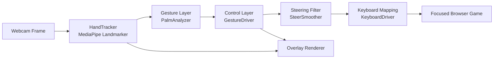

# Gesture Car Control

A real-time computer vision system that translates webcam hand gestures into keyboard controls for browser-based car games.

This project demonstrates end-to-end applied ML engineering: perception (hand landmarks), gesture classification, temporal filtering, control mapping, and live system feedback.

---

## Project Overview

`Gesture Car Control` lets a user steer, accelerate, and brake in online car games without touching a keyboard.

The system runs locally and performs this pipeline each frame:

1. Capture webcam frame
2. Detect and track hand landmarks with MediaPipe
3. Classify palm state (`OPEN`, `CLOSED`, `NEUTRAL`)
4. Smooth steering and debounce pedal actions
5. Emit keyboard events (arrow keys or WASD) to the focused game window

---

## Why This Project Matters

- **Human-computer interaction**: turns natural gestures into game input
- **Real-time systems**: balances responsiveness and stability
- **Applied AI**: integrates model inference with robust post-processing
- **Production thinking**: includes confidence thresholds, hysteresis, debouncing, and visual diagnostics

This is a strong portfolio project for roles in:
- Computer vision engineering
- ML/product engineering
- Interactive systems and game tooling
- Robotics/controls-adjacent software

---

## Key Features

- Dual control modes:
  - **Wheel mode** (two hands): steering wheel metaphor
  - **Pointer mode** (single hand): fallback for constrained camera setups
- Palm-state based pedals:
  - **Both palms closed** -> full speed
  - **Both palms open** -> brake
- Robust gesture detection:
  - Scale-invariant palm openness metrics
  - State hysteresis (different enter/exit thresholds)
  - Multi-frame confirmation before pedal activation
- Smooth steering stack:
  - Angle-domain smoothing
  - Rate-limited output
  - Keyboard hysteresis to avoid rapid left/right key flapping
- Live visual overlay:
  - Hand skeletons
  - Per-hand palm labels
  - Mode/status/HUD telemetry

---

## System Architecture



### Layer Responsibilities

- **Perception (`gesture_car/tracker.py`)**
  - Runs MediaPipe hand-landmarker inference
  - Applies landmark smoothing
  - Outputs normalized 21-point hand landmarks + handedness + confidence

- **Gesture classification (`gesture_car/gestures.py`)**
  - Computes palm openness from geometric ratios and finger spread
  - Uses confidence-aware temporal memory
  - Produces stable `OPEN` / `CLOSED` / `NEUTRAL` states

- **Control logic (`gesture_car/driver.py`)**
  - Maps hands to steering and pedals
  - Supports wheel and pointer modes
  - Debounces acceleration/brake transitions

- **Steering dynamics (`gesture_car/steer.py`)**
  - Smooths noisy angle updates
  - Enforces deadzone and per-frame rate limiting

- **Actuation (`gesture_car/keyboard_out.py`)**
  - Maps control outputs to `Arrow` or `WASD`
  - Applies key hysteresis near center to reduce jitter

- **Presentation (`gesture_car/overlay.py`, `gesture_car/ui.py`)**
  - Draws skeletons, labels, steering wheel, pedal bars, and status

---

## Control Design

### Wheel Mode (default)

- Steering: computed from angle between left and right palm centers
- Full speed: both palms detected as `CLOSED`
- Brake: both palms detected as `OPEN`

### Pointer Mode (fallback)

- Steering: one-hand palm center horizontal displacement
- Full speed: `CLOSED`
- Brake: `OPEN`

### Stability Mechanisms

- Hand confidence filtering (`MIN_HAND_SCORE`)
- Gesture hysteresis (separate enter/exit boundaries)
- Frame streak confirmation before pedal activation
- Smoothed steering output + keyboard enter/exit thresholds

---

## Repository Structure

```text
GesterControlledCarGame/
├── main.py                     # CLI entrypoint
├── download_model.py           # Downloads MediaPipe hand model
├── requirements.txt
├── README.md
└── gesture_car/
    ├── __init__.py
    ├── app.py                  # Main realtime loop and key handlers
    ├── tracker.py              # Hand detection + landmark smoothing
    ├── gestures.py             # Palm state classifier
    ├── driver.py               # Gesture-to-control policy
    ├── steer.py                # Steering smoother/filter
    ├── keyboard_out.py         # Keyboard output (arrows/WASD)
    ├── overlay.py              # Visual debug/HUD rendering
    ├── ui.py                   # Drawing primitives/colors
    └── models/
        └── hand_landmarker.task
```

---

## Tech Stack

- **Python** 3.9+
- **MediaPipe Tasks** (hand landmark model)
- **OpenCV** (camera I/O + rendering)
- **NumPy** (geometry and filtering math)
- **pynput** (keyboard event emission)

---

## Setup and Run

### 1) Install dependencies

```bash
pip install -r requirements.txt
```

### 2) Download model

```bash
python download_model.py
```

### 3) Launch app

```bash
python main.py
```

### Recommended Game

Use **[Slow Roads](https://slowroads.io)**. Its forgiving endless-driving
format and native arrow/WASD controls make it the best match for this
gesture controller. Press `G` inside the app to open it, press `TAB` to arm
the controller, then click the game window.

---

## Runtime Controls

| Key | Action |
|-----|--------|
| `TAB` | Arm/pause keyboard output |
| `M` | Toggle `WHEEL` / `POINTER` mode |
| `K` | Toggle `ARROWS` / `WASD` mapping |
| `G` | Open Slow Roads in the default browser |
| `H` | Show/hide help overlay |
| `Q` or `ESC` | Quit |

---

## Performance and Reliability Notes

- Input is filtered at multiple stages to reduce false triggers.
- Steering uses smoothing + hysteresis to maintain directional stability around center.
- The app sends keys only when controls are armed, reducing accidental input.
- Accuracy is sensitive to:
  - lighting quality
  - hand visibility in frame
  - camera placement and field of view

---

## Engineering Trade-offs

- **Responsiveness vs stability**: stronger smoothing improves control stability but increases latency.
- **Binary pedals vs analog throttle**: binary full-speed/brake is simpler and more robust for browser games.
- **Model confidence thresholding**: stricter thresholds reduce false positives but can drop detections in poor lighting.

---

## Future Improvements

- Per-user calibration flow (camera angle, gesture threshold tuning)
- Optional analog acceleration (gesture intensity -> throttle magnitude)
- Game profiles (different key layouts and sensitivity presets)
- Telemetry logging and replay tools for tuning
- Packaging as a desktop app with one-click start

---

## Recruiter Notes / Resume Highlights

Potential resume bullets based on this project:

- Built a real-time computer vision input system that maps hand gestures to keyboard controls for online car games using MediaPipe and OpenCV.
- Designed a multi-stage control pipeline with gesture hysteresis, confidence gating, and steering filters to reduce false triggers and directional jitter.
- Implemented dual interaction modes and live diagnostics overlays to improve robustness, usability, and debugging in production-like runtime conditions.

---

## Troubleshooting

| Problem | Fix |
|---------|-----|
| Model missing error | Run `python download_model.py` |
| Game not responding | Press `TAB` to arm, then click game window |
| Wrong input mapping | Press `K` to switch arrows/WASD |
| Unstable detection | Improve lighting and keep hands fully visible |
